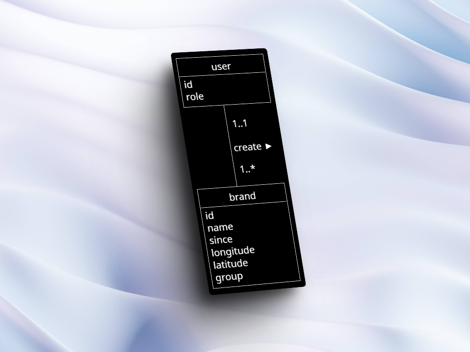

# Carap

## Projet

Pour ce projet, j'ai été mandaté de faire un projet en utilisant la library javascript `leaflet`.
Mon projet consiste a voir le lieu de création de la marque rechercher dans un input search.

## TimeTable

02.02.2024 - 3 période de 45 min

## DataBase

Concernant le MCD je suis partie sur une petite base, qui est suffisament complet pour le projet.

#### MCD

#### MLD

