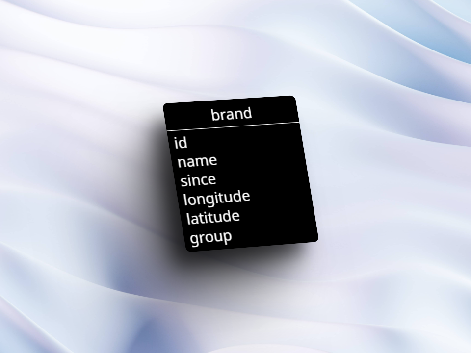

# Carap - Localisateur de marques de voitures

Bienvenue sur Carap ! Carap, qui signifie Car Application, est une application Web qui utilise Leaflet pour afficher la localisation des marques de voitures à travers le monde. Son objectif est de permettre aux utilisateurs de rechercher une marque de voiture spécifique et de découvrir dans quelle ville elle a été créée. En cliquant sur les marqueurs, les utilisateurs peuvent également accéder à des informations détaillées sur la marque, telles que la date de création et le groupe auquel elle appartient, ainsi que ses sous-marques.

## Projet

Pour ce projet, j'ai été mandaté de faire un projet en utilisant la library javascript `leaflet`.
Mon projet consiste a voir le lieu de création de la marque rechercher dans un input search.

## TimeTable

- 02.02.2024 - 3 période de 45 min
- 09.02.2024 - 2.5 période de 45 min
- 15.02.2024 - 30 min

## DataBase

Concernant le MCD je suis partie sur une petite base, qui est suffisament complet pour le projet et donc qui contient une table.

#### MCD

#### MLD

## Fonctionnalités

- Recherche de marques de voitures : Les utilisateurs peuvent rechercher une marque de voiture spécifique à l'aide de l'interface de recherche.
- Affichage des détails : En cliquant sur un marqueur sur la carte, les utilisateurs peuvent accéder à des informations détaillées sur la marque, y compris la date de création et le groupe auquel elle appartient.
- Liste des marques disponibles : En bas de la page, les utilisateurs peuvent consulter une liste de toutes les marques de voitures disponibles dans l'application.

## Technologies utilisées

- HTML, CSS, JavaScript pour le développement de l'interface utilisateur.
- Leaflet pour l'affichage de la carte et des marqueurs.
- Données de localisation des marques de voitures provenant d'une BDD en localhost.

    